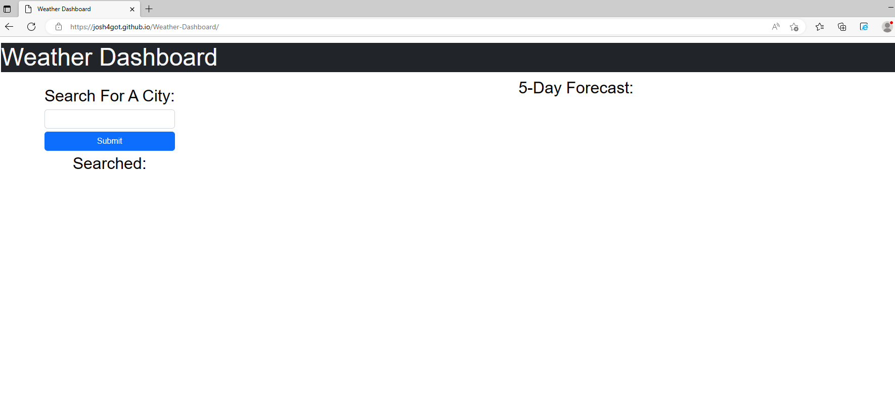

# Weather-Dashboard

## Description

This web application can be used to help a user check the current and future weather by city name. It can display the current weather and 5 day forcast on the webpage. This project was built using an understand of javascript, jQuery and server side APIs such as the Openweather API

## Installation

[DeployedWebpage](https://josh4got.github.io/Weather-Dashboard/)

## Usage

To use this web application a user can search for a city using the search box. the user will be presented with the current weather conditions as well as a 5 day forecast.

The user can click on buttons in the search history to quickly view the weather in recently searched city.

## Credits

[jQuery](https://api.jquery.com/)

[Bootstrap 5](https://getbootstrap.com/docs/5.0/getting-started/introduction/)

[Openweather API](https://openweathermap.org/api)

## License

Please see LICENSE in the repo.
